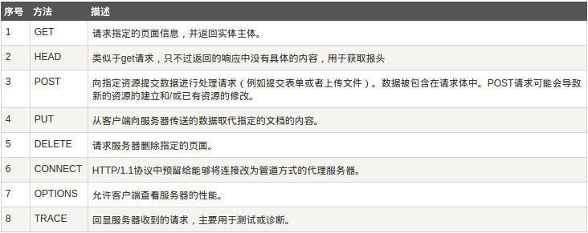
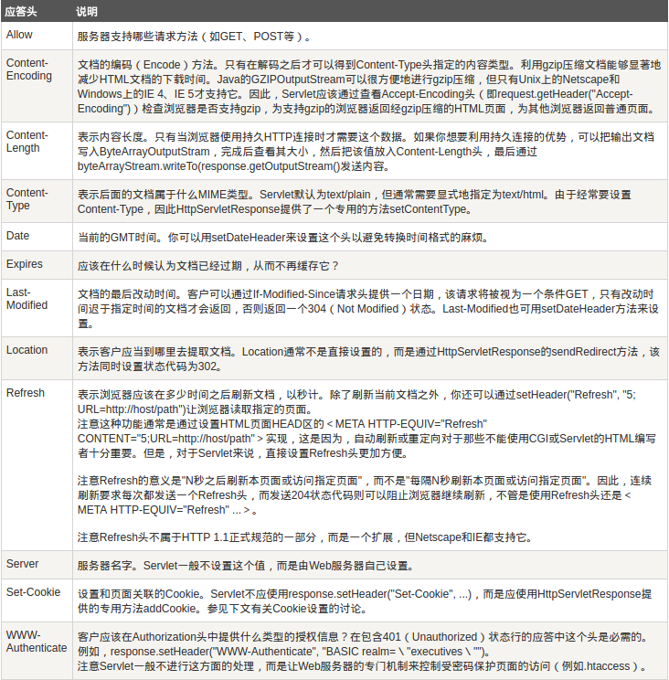
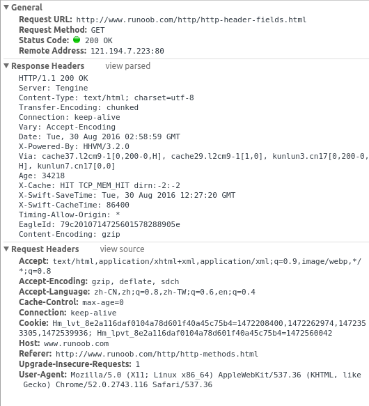
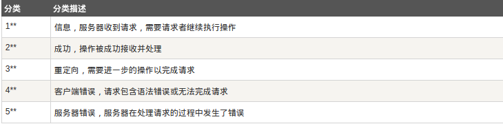
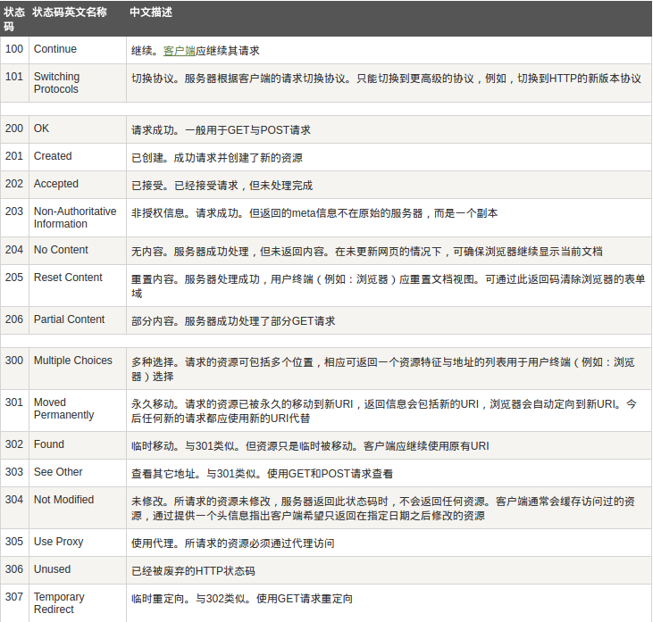
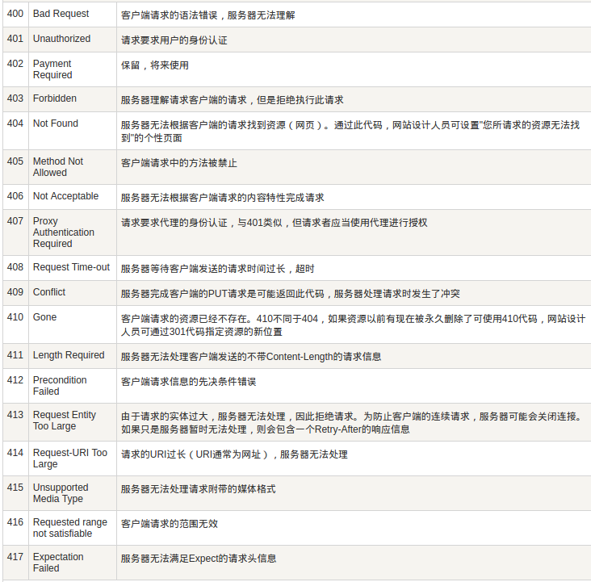
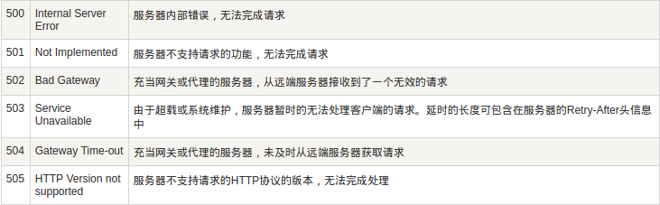
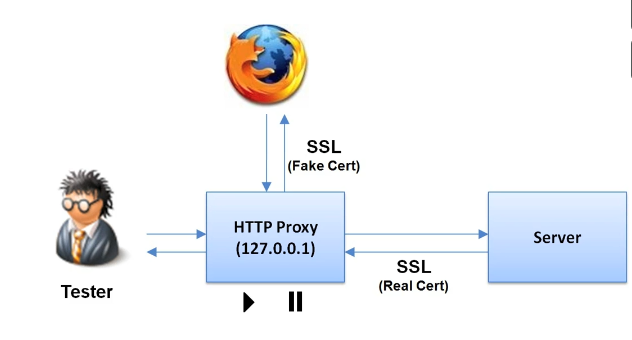

@(CTF)[HTTP, OWASP, python, mysql, 渗透测试环境]

[TOC]
# Web基础-HTTP

web知识点很多，而且很杂。我们只能挑一些有共性的来学，选一些来讲，碰到不会的就现学现查，大部分靠自觉。

# 主要内容
 本周计划要学的东西分为四个方面，
## 1. 协议
1. HTTP
 推荐图书《图解HTTP》

## 2. 语言
1. HTML/CSS
http://www.w3school.com.cn/h.asp
1. javascript
http://www.w3school.com.cn/b.asp
1. mysql
 http://www.cnblogs.com/mr-wid/archive/2013/05/09/3068229.html#c1

1. python
 https://www.liaoxuefeng.com/wiki/0014316089557264a6b348958f449949df42a6d3a2e542c000
1. php
http://www.w3school.com.cn/php/index.asp
## 3. 了解Web漏洞类型
1. OWASP
 http://www.owasp.org.cn/owasp-project/OWASPTop102017RC2.pdf
1. Web 安全深度剖析
 
## 4. 实验环境
1. 搭建渗透测试环境
 我这用的是win7+xampp
 http://www.freebuf.com/sectool/102661.html
1. 浏览器 firefox或者chrome，（最好找旧版本的，因为新版本的限制多）
1. 抓包工具burpsuite
 * 下载
 `链接: https://pan.baidu.com/s/1eSkyF0e 密码: e27e`(有时间限制，请尽快下载)
* 使用介绍
	* http://www.360doc.com/content/16/0425/10/29967943_553593234.shtml
	* https://www.gitbook.com/book/t0data/burpsuite/details
	* https://www.sinosky.org/burp-suite-walkthrough.html
	* https://t0data.gitbooks.io/burpsuite/content/#1F

下面是我学HTTP的笔记，看完可以对HTTP有个简略印象，要学得深入点，建议看完《图解HTTP》，并多做实验观察，多思考，多动手。

---
# HTTP学习笔记

## 1.HTTP简介
* [HTTP][1]协议是Hyper Text Transfer Protocol（超文本传输协议）的缩写,是用于从万维网(WWW:World Wide Web)服务器传输超文本到本地浏览器的传送协议。
* HTTP是一个基于TCP/IP通信协议来传递数据（HTML 文件, 图片文件, 查询结果等）。

## 2.HTTP工作原理
HTTP协议工作于客户端-服务端架构为上。浏览器作为HTTP客户端通过`URL`向`HTTP`服务端即`WEB`服务器发送所有请求。

Web服务器有：`Apache`服务器，`Nginx`服务器，`IIS`服务器（`Internet Information Services`）等。

Web服务器根据接收到的请求后，向客户端发送响应信息。

`HTTP`默认端口号为`80`，但是你也可以改为`8080`或者其他端口。

### 2.1 HTTP三点注意事项

* HTTP是无连接

 无连接的含义是限制每次连接只处理一个请求。服务器处理完客户的请求，并收到客户的应答后，即断开连接。采用这种方式可以节省传输时间。
* HTTP是媒体独立的

这意味着，只要客户端和服务器知道如何处理的数据内容，任何类型的数据都可以通过HTTP发送。客户端以及服务器指定使用适合的MIME-type内容类型。
* HTTP是无状态

HTTP协议是无状态协议。无状态是指协议对于事务处理没有记忆能力。缺少状态意味着如果后续处理需要前面的信息，则它必须重传，这样可能导致每次连接传送的数据量增大。另一方面，在服务器不需要先前信息时它的应答就较快。

以下图表展示了HTTP协议通信流程：


### 2.2 URI与URL
* URI

    URI是Uniform Resource Identifier的缩写，是由某个协议方案表示的资源的定位标识符。协议方案是指访问资源所使用的协议类型名称。 采用HTTP协议时，协议方案就是http。除此之外，还有ftp、mailto、telnet、file等。
* URL

    Uniform Resource Locator，统一资源定位符,表示资源在互联网上的地址，它其实是URI的一个子集
URI仅仅表示「标识」， 标识的类型有很多，比如ISBN号码，电话号码，邮箱，网页链接地址等，而URL则把概念缩小到了「地址」。
由于URI在绝大多数场景下都是以URL的形式存在，大家一般都说URL居多，这也没什么问题，但是在心里要清楚URI和URL还是有所区别的。

## 3. HTTP所属层次
HTTP协议是TCP/IP协议族中应用层的一种协议，也可以说是现在Web中应用最为广泛的一个协议了。

> 就像人与人之间的交流合作需要协议来规范一样，网络中的计算机也是同理：从电缆的规格到IP地址的选定方法、寻找异地用户的方法、双方建立通信的顺序，以及Web页面显示需要处理的步骤……，这些一些列规则都要实现定制好，才能让网络中千千万万的计算机之间的交流不乱套。这些一系列的规则就构成了**TCP/IP协议族**。
**分层**：每一层完成一个特定的任务--封装，每一层对上一层提供服务时，上一层的数据结构是黑盒，直接作为本层的数据，而不需要关心上一层协议得任何细节，层内部的变化不会影响到其他层。


## 4. HTTP 消息结构

* HTTP是基于客户端/服务端（C/S）的架构模型，通过一个可靠的链接来交换信息，是一个无状态的请求/响应协议。
* 一个HTTP`客户端`是一个应用程序（Web浏览器或其他任何客户端），通过连接到服务器达到向服务器发送一个或多个HTTP的请求的目的。
* 一个HTTP`服务器`同样也是一个应用程序（通常是一个Web服务，如Apache Web服务器或IIS服务器等），通过接收客户端的请求并向客户端发送HTTP响应数据。
* HTTP使用统一资源标识符（`Uniform Resource Identifiers`, `URI`）来传输数据和建立连接。
* 一旦建立连接后，数据消息就通过类似Internet邮件所使用的格式[RFC5322](http://www.ietf.org/rfc/rfc5322.txt)和多用途`Internet邮件扩展`（`MIME`）[RFC2045](http://www.ietf.org/rfc/rfc2045.txt)来传送。

## 5. 客户端请求消息

>客户端发送一个HTTP请求到服务器的请求消息包括以下格式：请求行（request line）、请求头部（header）、空行和请求数据四个部分组成。


## 6. 服务器响应消息

>HTTP响应也由四个部分组成，分别是：状态行、消息报头、空行和响应正文。


## 7. HTTP请求方法

>根据HTTP标准，HTTP请求可以使用多种请求方法。
HTTP1.0定义了三种请求方法： GET, POST 和 HEAD方法。
HTTP1.1新增了五种请求方法：OPTIONS, PUT, DELETE, TRACE 和 CONNECT 方法。



## 8. HTTP 响应头信息

HTTP请求头提供了关于请求，响应或者其他的发送实体的信息。



For example:




## 9. HTTP状态码

当浏览者访问一个网页时，浏览者的浏览器会向网页所在服务器发出请求。当浏览器接收并显示网页前，此网页所在的服务器会返回一个包含HTTP状态码的信息头（server header）用以响应浏览器的请求。

HTTP状态码的英文为`HTTP Status Code`。

下面是常见的HTTP状态码：
- 200 - 请求成功
- 301 - 资源（网页等）被永久转移到其它URL
- 404 - 请求的资源（网页等）不存在
- 500 - 内部服务器错误


## 10. HTTP状态码分类

HTTP状态码由三个十进制数字组成，第一个十进制数字定义了状态码的类型，后两个数字没有分类的作用。HTTP状态码共分为5种类型：









## 11. HTTP content-type

* `Content-Type`，内容类型，

一般是指网页中存在的Content-Type，用于定义网络文件的类型和网页的编码，决定浏览器将以什么形式、什么编码读取这个文件，这就是经常看到一些Asp网页点击的结果却是下载到的一个文件或一张图片的原因。

## 12. Session ID
HTTP协议不保持请求之间的状态，为了维护状态，得使用状态追踪机制。

一个会话标识符（Session ID）通常在请求中传递，以将请求与回话相关联。

Session ID 通常通过以下方式来传递：
* URL
* 隐藏的表单字段
* HTTP报文头中的Cookie字段

## 13. Cookies
最常见用来传递Session ID的地方

发起一个回话时，服务器发送一个`Set-Cookie`响应头
* 以一个`NAME=VALUE`键值对开始
* 后跟0个或更多分号分割的属性值对
    * Domain，Path，Expires，Secure
```
Set-Cookie: SID=5KXIOt4cS; expires=Mon, 31-May-2010 20:46:01 GMT; path=/; domain=.abc.com; HttpOnly
```
## 14. GET和POST的区别
[总的来说][2]，GET是用来**获取资源**，POST使用来**处理资源**，在RFC7231中是这么说的：

    The GET method requests transfer of a current selected representation for the target resource. GET is the primary mechanism of information retrieval and the focus of almost all performance optimizations. Hence, when people speak of retrieving some identifiable information via HTTP, they are generally referring to making a GET request.
    A payload within a GET request message has no defined semantics; sending a payload body on a GET request might cause some existing implementations to reject the request.
    
    The POST method requests that the target resource process the representation enclosed in the request according to the resource's own specific semantics.

这里牵涉到一个很重要的词语：`semantic` 「语义」，那么[什么是语义](http://blog.darkmi.com/2013/04/10/3018.html)呢？

    一种语言是合法句子的集合。什么样的句子是合法的呢？可以从两方面来判断：语法和语义。语法是和文法结构有关，然而语义是和按照这个结构所组合的单词符号的意义有关。合理的语法结构并不表明语义是合法的。例如我们常说：我上大学，这个句子是符合语法规则的，也符合语义规则。但是大学上我，虽然符合语法规则，但没有什么意义，所以说是不符合语义的。
    
对于HTTP请求来说，语法是指请求响应的格式，比如请求第一行必须是`方法名 URI 协议/版本`,具体的内容可以参见《图解HTTP》，凡是符合这个格式的请求都是合法的。
当然在符合合法的前提下实现违背语义的行为也是可以做到的，比如使用GET方法修改用户信息，POST获取资源列表。


## 15. HTTP Proxies
burp拦截HTTP请求的原理图




# 作业：
1. 学习HTTP协议，尝试用浏览器（chrome或者firefox）和burpsuite分别抓取HTTP请求头和响应头,截图放在自己笔记中提交到版本库中
1. 请用自己的话简述在浏览器地址栏中输入网址`www.baidu.com`，从按回车键到页面显示这个过程中，发生了什么？

这其中可能会涉及到一些你不熟悉的知识，去百度去谷歌，并请尽可能的去吸收它，并且在初步回答后，再想想，真的是这样吗？还能再细致点吗？直到自己挑不出问题时，将你的回答形成`md`文档提交到版本库中

**请按要求格式提交作业：在版本库中所在组内创建以自己github账号名字命名的文件夹，然后把作业放在自己文件夹内，作业文件名称让人能看懂就行，通过PR提交**


[1]: http://www.jianshu.com/p/8a125a16f5d3
[2]: https://sunshinevvv.coding.me/blog/2017/02/09/HttpGETv.s.POST/
