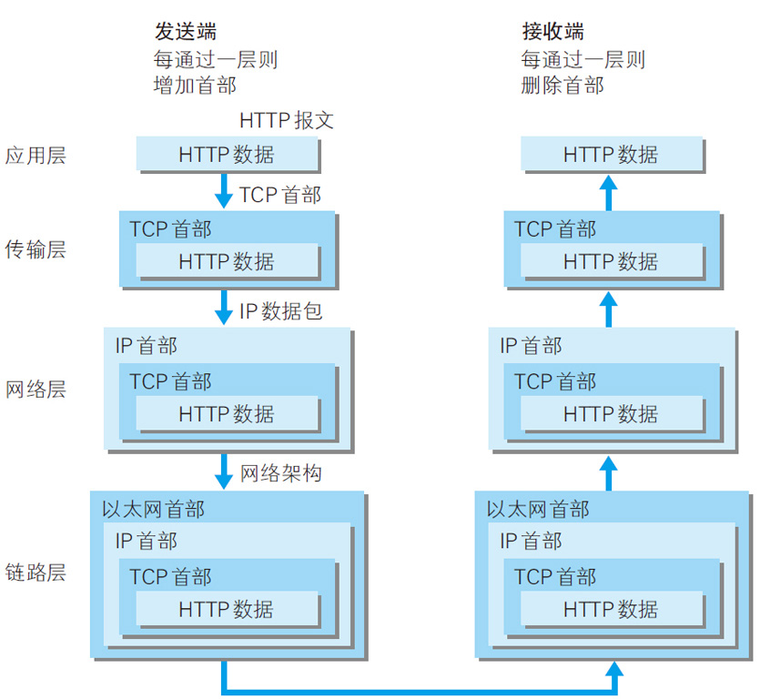
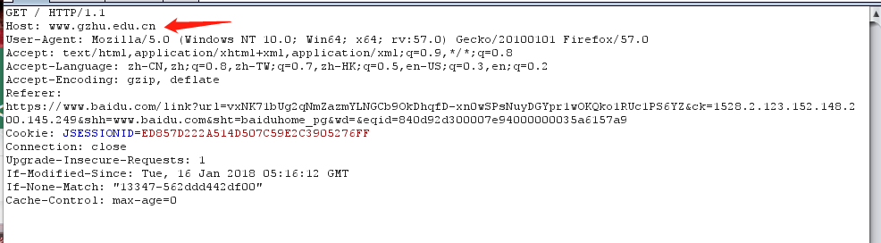
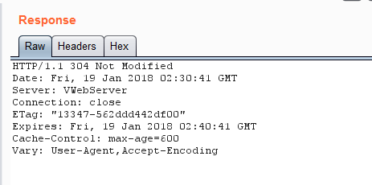
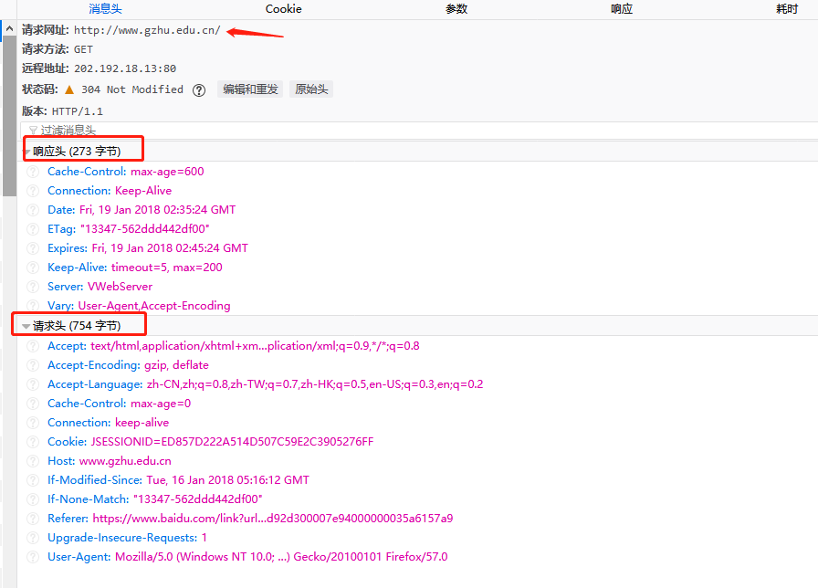

### HTTP学习
#### HTTP简介

+ HTTP协议是Hyper Text Transfer Protocol（超文本传输协议）的缩写,是用于从万维网(WWW:World Wide Web)服务器传输超文本到本地浏览器的传送协议。
+ HTTP是一个基于TCP/IP通信协议来传递数据（HTML 文件, 图片文件, 查询结果等）。
#### HTTP工作原理
HTTP协议工作于客户端-服务端架构为上。浏览器作为HTTP客户端通过`URL`向`HTTP`服务端即WEB服务器发送所有请求。

Web服务器有：`Apache`服务器，`Nginx`服务器，`IIS`服务器（`Internet Information Services`）等。

Web服务器根据接收到的请求后，向客户端发送响应信息。

`HTTP`默认端口号为`80`，但是你也可以改为`8080`或者其他端口。

##### HTTP注意点
+ HTTP是无连接
无连接的含义是限制每次连接只处理一个请求。服务器处理完客户的请求，并收到客户的应答后，即断开连接。采用这种方式可以节省传输时间。
+ HTTP是媒体独立的
这意味着，只要客户端和服务器知道如何处理的数据内容，任何类型的数据都可以通过HTTP发送。客户端以及服务器指定使用适合的MIME-type内容类型。
+ HTTP是无状态
HTTP协议是无状态协议。无状态是指协议对于事务处理没有记忆能力。缺少状态意味着如果后续处理需要前面的信息，则它必须重传，这样可能导致每次连接传送的数据量增大。另一方面，在服务器不需要先前信息时它的应答就较快。
下图是HTTP的通信过程

#### HTTP所属层次
HTTP协议是TCP/IP协议族中应用层的一种协议，也可以说是现在Web中应用最为广泛的一个协议了。 

就像人与人之间的交流合作需要协议来规范一样，网络中的计算机也是同理：从电缆的规格到IP地址的选定方法、寻找异地用户的方法、双方建立通信的顺序，以及Web页面显示需要处理的步骤……，这些一些列规则都要实现定制好，才能让网络中千千万万的计算机之间的交流不乱套。这些一系列的规则就构成了TCP/IP协议族。 分层：每一层完成一个特定的任务--封装，每一层对上一层提供服务时，上一层的数据结构是黑盒，直接作为本层的数据，而不需要关心上一层协议得任何细节，层内部的变化不会影响到其他层。

#### 客户端请求消息
客户端发送一个HTTP请求到服务器的请求消息包括以下格式：请求行（request line）、请求头部（header）、空行和请求数据四个部分组成。

#### 服务器响应消息
HTTP响应也由四个部分组成，分别是：状态行、消息报头、空行和响应正文。

#### HTTP请求方法
根据HTTP标准，HTTP请求可以使用多种请求方法。 HTTP1.0定义了三种请求方法： GET, POST 和 HEAD方法。 HTTP1.1新增了五种请求方法：OPTIONS, PUT, DELETE, TRACE 和 CONNECT 方法。

#### HTTP 响应信息

在接收和解释请求消息后，服务器返回一个HTTP响应消息。

HTTP响应也是由三个部分组成，分别是：状态行、消息报头、响应正文
1、状态行格式如下：
`HTTP-Version Status-Code Reason-Phrase CRLF`
其中，`HTTP-Version`表示服务器`HTTP`协议的版本；`Status-Code`表示服务器发回的响应状态代码；`Reason-Phrase`表示状态代码的文本描述。
状态代码有三位数字组成，第一个数字定义了响应的类别，且有五种可能取值：
1xx：指示信息--表示请求已接收，继续处理
2xx：成功--表示请求已被成功接收、理解、接受
3xx：重定向--要完成请求必须进行更进一步的操作
4xx：客户端错误--请求有语法错误或请求无法实现
5xx：服务器端错误--服务器未能实现合法的请求
常见状态代码、状态描述、说明：
200` OK `     //客户端请求成功
400 `Bad Request  `//客户端请求有语法错误，不能被服务器所理解
401 `Unauthorized `//请求未经授权，这个状态代码必须和`WWW-Authenticate`报头域一起使用 
403 `Forbidden`  //服务器收到请求，但是拒绝提供服务
404 `Not Found ` //请求资源不存在，eg：输入了错误的URL
500 `Internal Server Error` //服务器发生不可预期的错误
503` Server Unavailable`  //服务器当前不能处理客户端的请求，一段时间后可能恢复正常
`eg：HTTP/1.1 200 OK （CRLF）`

2、响应报头后述

3、响应正文就是服务器返回的资源的内容 

#### HTTP消息报头

HTTP消息由客户端到服务器的请求和服务器到客户端的响应组成。请求消息和响应消息都是由开始行（对于请求消息，开始行就是请求行，对于响应消息，开始行就是状态行），消息报头（可选），空行（只有CRLF的行），消息正文（可选）组成。

HTTP消息报头包括普通报头、请求报头、响应报头、实体报头。
每一个报头域都是由名字+“：”+空格+值 组成，消息报头域的名字是大小写无关的。

1、普通报头
在普通报头中，有少数报头域用于所有的请求和响应消息，但并不用于被传输的实体，只用于传输的消息。
eg：
Cache-Control   用于指定缓存指令，缓存指令是单向的（响应中出现的缓存指令在请求中未必会出现），且是独立的（一个消息的缓存指令不会影响另一个消息处理的缓存机制），HTTP1.0使用的类似的报头域为Pragma。
请求时的缓存指令包括：no-cache（用于指示请求或响应消息不能缓存）、no-store、max-age、max-stale、min-fresh、only-if-cached;
响应时的缓存指令包括：public、private、no-cache、no-store、no-transform、must-revalidate、proxy-revalidate、max-age、s-maxage.
eg：为了指示IE浏览器（客户端）不要缓存页面，服务器端的JSP程序可以编写如下：response.sehHeader("Cache-Control","no-cache");
//response.setHeader("Pragma","no-cache");作用相当于上述代码，通常两者//合用
这句代码将在发送的响应消息中设置普通报头域：Cache-Control:no-cache

Date普通报头域表示消息产生的日期和时间

Connection普通报头域允许发送指定连接的选项。例如指定连接是连续，或者指定“close”选项，通知服务器，在响应完成后，关闭连接

2、请求报头
请求报头允许客户端向服务器端传递请求的附加信息以及客户端自身的信息。
常用的请求报头
Accept
Accept请求报头域用于指定客户端接受哪些类型的信息。eg：Accept：image/gif，表明客户端希望接受GIF图象格式的资源；Accept：text/html，表明客户端希望接受html文本。
Accept-Charset
Accept-Charset请求报头域用于指定客户端接受的字符集。eg：Accept-Charset:iso-8859-1,gb2312.如果在请求消息中没有设置这个域，缺省是任何字符集都可以接受。
Accept-Encoding
Accept-Encoding请求报头域类似于Accept，但是它是用于指定可接受的内容编码。eg：Accept-Encoding:gzip.deflate.如果请求消息中没有设置这个域服务器假定客户端对各种内容编码都可以接受。
Accept-Language
Accept-Language请求报头域类似于Accept，但是它是用于指定一种自然语言。eg：Accept-Language:zh-cn.如果请求消息中没有设置这个报头域，服务器假定客户端对各种语言都可以接受。
Authorization
Authorization请求报头域主要用于证明客户端有权查看某个资源。当浏览器访问一个页面时，如果收到服务器的响应代码为401（未授权），可以发送一个包含Authorization请求报头域的请求，要求服务器对其进行验证。
Host（发送请求时，该报头域是必需的）
Host请求报头域主要用于指定被请求资源的Internet主机和端口号，它通常从HTTP URL中提取出来的，eg：
我们在浏览器中输入：http://www.guet.edu.cn/index.html
浏览器发送的请求消息中，就会包含Host请求报头域，如下：
Host：www.guet.edu.cn
此处使用缺省端口号80，若指定了端口号，则变成：Host：www.guet.edu.cn:指定端口号
User-Agent
我们上网登陆论坛的时候，往往会看到一些欢迎信息，其中列出了你的操作系统的名称和版本，你所使用的浏览器的名称和版本，这往往让很多人感到很神奇，实际上，服务器应用程序就是从User-Agent这个请求报头域中获取到这些信息。User-Agent请求报头域允许客户端将它的操作系统、浏览器和其它属性告诉服务器。不过，这个报头域不是必需的，如果我们自己编写一个浏览器，不使用User-Agent请求报头域，那么服务器端就无法得知我们的信息了。
请求报头举例：
GET /form.html HTTP/1.1 (CRLF)
Accept:image/gif,image/x-xbitmap,image/jpeg,application/x-shockwave-flash,application/vnd.ms-excel,application/vnd.ms-powerpoint,application/msword,*/* (CRLF)
Accept-Language:zh-cn (CRLF)
Accept-Encoding:gzip,deflate (CRLF)
If-Modified-Since:Wed,05 Jan 2007 11:21:25 GMT (CRLF)
If-None-Match:W/"80b1a4c018f3c41:8317" (CRLF)
User-Agent:Mozilla/4.0(compatible;MSIE6.0;Windows NT 5.0) (CRLF)
Host:www.guet.edu.cn (CRLF)
Connection:Keep-Alive (CRLF)
(CRLF)

3、响应报头
响应报头允许服务器传递不能放在状态行中的附加响应信息，以及关于服务器的信息和对Request-URI所标识的资源进行下一步访问的信息。
常用的响应报头
Location
Location响应报头域用于重定向接受者到一个新的位置。Location响应报头域常用在更换域名的时候。
Server
Server响应报头域包含了服务器用来处理请求的软件信息。与User-Agent请求报头域是相对应的。下面是
Server响应报头域的一个例子：
Server：Apache-Coyote/1.1
WWW-Authenticate
WWW-Authenticate响应报头域必须被包含在401（未授权的）响应消息中，客户端收到401响应消息时候，并发送Authorization报头域请求服务器对其进行验证时，服务端响应报头就包含该报头域。
eg：WWW-Authenticate:Basic realm="Basic Auth Test!"  //可以看出服务器对请求资源采用的是基本验证机制。

4、实体报头
请求和响应消息都可以传送一个实体。一个实体由实体报头域和实体正文组成，但并不是说实体报头域和实体正文要在一起发送，可以只发送实体报头域。实体报头定义了关于实体正文（eg：有无实体正文）和请求所标识的资源的元信息。
常用的实体报头
Content-Encoding
Content-Encoding实体报头域被用作媒体类型的修饰符，它的值指示了已经被应用到实体正文的附加内容的编码，因而要获得Content-Type报头域中所引用的媒体类型，必须采用相应的解码机制。Content-Encoding这样用于记录文档的压缩方法，eg：Content-Encoding：gzip
Content-Language
Content-Language实体报头域描述了资源所用的自然语言。没有设置该域则认为实体内容将提供给所有的语言阅读
者。eg：Content-Language:da
Content-Length
Content-Length实体报头域用于指明实体正文的长度，以字节方式存储的十进制数字来表示。
Content-Type
Content-Type实体报头域用语指明发送给接收者的实体正文的媒体类型。eg：
Content-Type:text/html;charset=ISO-8859-1
Content-Type:text/html;charset=GB2312
Last-Modified
Last-Modified实体报头域用于指示资源的最后修改日期和时间。
Expires
Expires实体报头域给出响应过期的日期和时间。为了让代理服务器或浏览器在一段时间以后更新缓存中(再次访问曾访问过的页面时，直接从缓存中加载，缩短响应时间和降低服务器负载)的页面，我们可以使用Expires实体报头域指定页面过期的时间。eg：Expires：Thu，15 Sep 2006 16:23:12 GMT
HTTP1.1的客户端和缓存必须将其他非法的日期格式（包括0）看作已经过期。eg：为了让浏览器不要缓存页面，我们也可以利用Expires实体报头域，设置为0，jsp中程序如下：response.setDateHeader("Expires","0");

# 作业：
1. 学习HTTP协议，尝试用浏览器（chrome或者firefox）和burpsuite分别抓取HTTP请求头和响应头,截图放在自己笔记中提交到版本库中

2. 请用自己的话简述在浏览器地址栏中输入网址`www.baidu.com`，从按回车键到页面显示这个过程中，发生了什么？

1. 当我们在浏览器上输入网址`www.baidu.com`时， 浏览器会解析出该url的域名，将域名转化为 IP 地址，依次查询 本地服务器、浏览器DNS缓存、系统缓存、路由器缓存、如果没有找到 则一直查询到 根域名服务器缓存，找到域名所对应的的 IP地址。(应用层DNS解析域名)
2. 向IP所对应的的服务器发送请求数据，传输层TCP传输报文，网络层IP协议查询MAC地址，数据到达数据链路层，服务器接收数据，服务器响应请求，服务器返回相应文件。
3. 若整个流程都请求成功后，服务器会返回相应的HTML文件。接下来就到了页面的渲染阶段。
4. 页面渲染(客户端浏览器获取网页内容，解析，并显示在浏览器上)

+ [参考文章](https://www.cnblogs.com/kongxy/p/4615226.html)

