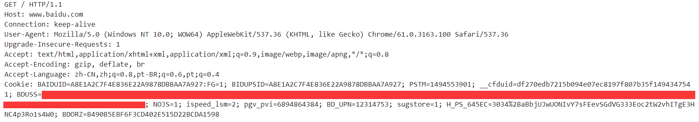
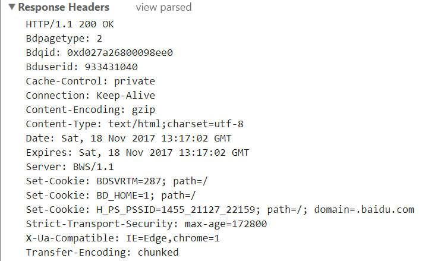
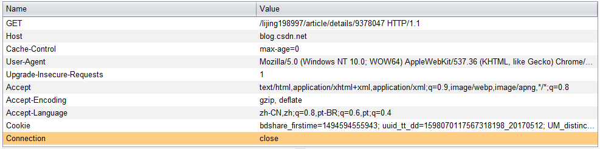
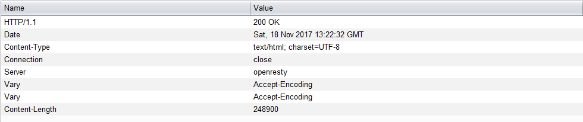

# HTTP
## Capture
### Chrome Request

### Chrome Response

### Burpsuite Request

### Burpsuite Response

## Http request and response

首先浏览器根据浏览器设置、系统信息、url信息组成http request包，根据url判定协议，chrome输入的url如果没有指定协议默认使用http

查询缓存、host、dns服务器获取百度的ip

经过传输层、网络层、数据链路层组包，在数据链路层发送出去

经过交换机、路由器、负载均衡到达百度服务器

百度服务器对报文向上解析到应用层，并根据头信息寻找定位请求的资源

服务器通过php、jsp或asp执行网页脚本，百度首页采用强制https访问，http response会返回302，然后按照原来的方式返回到客户的浏览器中（网络上的传输路径可能不同）

浏览器接收到http response后解析

浏览器解析到302后进行跳转，重新发送请求给百度（ssl认证部分略），百度再次返回https response

浏览器再次从response header中解析head、body的信息，如果body是html，则对html文本进行解析

并根据css进行渲染，解析js并且运行js

最后显示到屏幕
